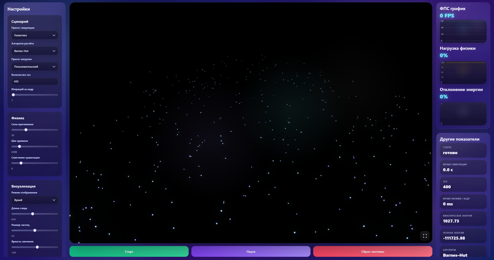
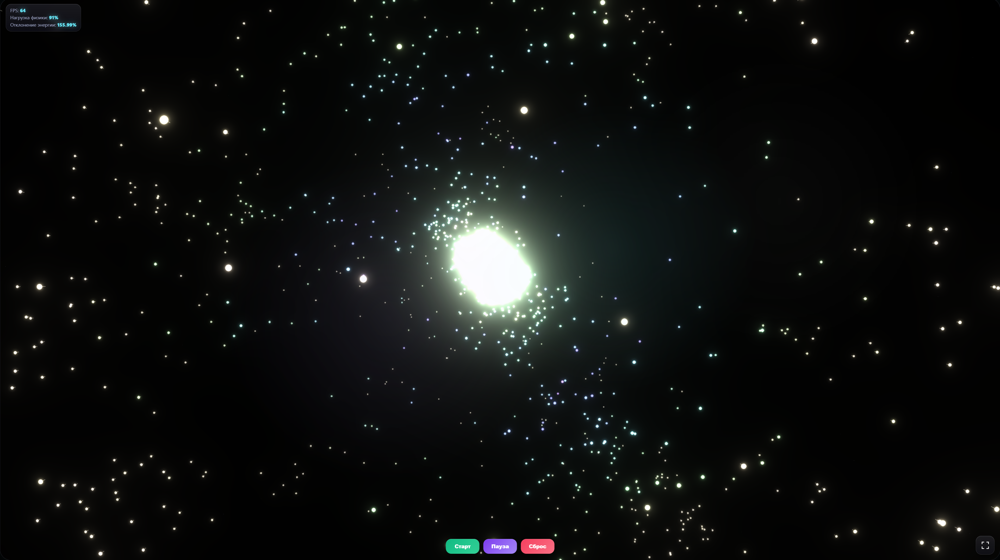

# N-Body PWA Benchmark


**N-Body PWA Benchmark** — это браузерная 3D-симуляция задачи N тел и бенчмарк производительности, созданный с использованием **JavaScript**, **Three.js**, **Rust/WebAssembly** и **PWA**-технологий.

Проект моделирует гравитационное взаимодействие большого количества тел и использует эту вычислительную нагрузку для сравнения производительности разных устройств, алгоритмов и пресетов симуляции.

> Тема проекта: **Бенчмарк технологии PWA, основанный на решении задачи N тел**

---

## Демонстрация






---

## Обзор

Проект ориентирован на две основные задачи:

1. **Симуляция задачи N тел**  
   Визуализация в реальном времени большого количества тел, взаимодействующих друг с другом под действием гравитации.

2. **Бенчмарк PWA-приложения**  
   Оценка того, насколько эффективно браузерное PWA-приложение справляется с тяжёлыми физическими вычислениями и 3D-рендерингом на разных устройствах.

Физические расчёты выполняются с помощью **WebAssembly**, а визуализация реализована через **Three.js/WebGL**.  
Результаты бенчмарка можно сохранять и сравнивать на отдельной странице результатов.

---

## Содержание

- [Возможности](#возможности)
- [Управление](#управление)
- [Доступные алгоритмы](#доступные-алгоритмы)
- [Доступные сценарии симуляции](#доступные-сценарии-симуляции)
- [Доступные пресеты нагрузки](#доступные-пресеты-нагрузки)
- [Метрики бенчмарка](#метрики-бенчмарка)
- [Таблица результатов](#таблица-результатов)
- [Структура проекта](#структура-проекта)

---

## Возможности

- 3D-симуляция задачи N тел в браузере.
- Физический движок на Rust/WebAssembly.
- Визуализация через Three.js/WebGL.
- Поддержка PWA.
- Полноэкранный режим симуляции.
- Настраиваемые параметры симуляции.
- Несколько сценариев симуляции.
- Несколько пресетов нагрузки.
- Алгоритмы Barnes–Hut и прямой метод.
- График FPS.
- График нагрузки физики.
- График отклонения энергии.
- Секундомер времени симуляции.
- Сохранение результатов бенчмарка.
- Общая таблица результатов через Supabase.
- Сортировка и группировка результатов.
- Модальное окно с информацией об устройстве.
- Модальное окно с настройками сохранённого теста.

---

## Управление

| Элемент | Действие |
|---|---|
| Кнопка «Старт» | Запускает симуляцию |
| Кнопка «Пауза» | Приостанавливает симуляцию |
| Кнопка «Сброс системы» | Сбрасывает текущую симуляцию |
| Перетаскивание мышью | Управление камерой |
| Колесо мыши | Приближение и отдаление камеры |
| Кнопка полноэкранного режима | Открывает симуляцию во весь экран |
| Кнопка «Записать результат» | Сохраняет текущий результат бенчмарка |
| Кнопка «Общие результаты» | Открывает таблицу сохранённых результатов |

---

## Доступные алгоритмы

| Алгоритм | Описание | Сложность |
|---|---|---|
| Прямой метод | Рассчитывает взаимодействие каждой пары тел. Более точный, но очень затратный при большом количестве тел. | O(n²) |
| Barnes–Hut | Приближает удалённые группы тел как один центр масс с использованием пространственного дерева. Лучше подходит для больших систем. | O(n log n) |

Прямой метод полезен для небольших симуляций и сравнительных тестов.  
Barnes–Hut является основным алгоритмом для большого количества тел.

---

## Доступные сценарии симуляции

| Сценарий | Описание |
|---|---|
| Галактика | Тела распределяются как вращающаяся галактическая система |
| Коллапс | Тела стартуют в компактной области и сжимаются под действием гравитации |
| Взрыв | Тела появляются внутри сферы и начинают движение наружу |
| Две галактики | Две галактические системы взаимодействуют друг с другом |

---

## Доступные пресеты нагрузки

| Пресет | Назначение |
|---|---|
| Пользовательский | Ручная настройка параметров |
| Лёгкий | Низкая нагрузка для слабых устройств |
| Сбалансированный | Базовый режим бенчмарка |
| Качественный | Больше тел и более выраженные визуальные эффекты |
| Высокая нагрузка | Промежуточный тяжёлый пресет |
| Стресс-тест | Высокая нагрузка для проверки производительности |
| Тест прямого метода | Небольшой пресет для проверки прямого метода |

---

## Метрики бенчмарка

| Метрика | Описание |
|---|---|
| FPS | Частота отрисовки кадров |
| Время физики / кадр | Время, затрачиваемое на расчёт физики за один кадр |
| Среднее время физики | Среднее время расчёта физики |
| Нагрузка физики | Доля бюджета кадра, занятая физическим расчётом |
| Отклонение энергии | Изменение полной энергии системы относительно начального значения |
| Кинетическая энергия | Суммарная кинетическая энергия всех тел |
| Полная энергия | Сумма кинетической и потенциальной энергии |
| Время симуляции | Время с момента запуска симуляции |

Метрика **«Нагрузка физики»** не является реальной системной загрузкой CPU.  
Она показывает, какую часть бюджета кадра занимает расчёт физической модели.

---

## Таблица результатов

Результаты бенчмарка сохраняются в Supabase и отображаются на отдельной странице.

Сохраняемые данные:

- дата и время;
- информация об устройстве;
- операционная система;
- браузер;
- количество логических потоков CPU;
- примерный объём RAM;
- WebGL renderer / GPU рендера;
- разрешение экрана;
- размер окна приложения;
- DPR;
- алгоритм расчёта;
- сценарий симуляции;
- пресет нагрузки;
- количество тел;
- FPS;
- время симуляции;
- время физики;
- среднее время физики;
- нагрузка физики;
- отклонение энергии;
- кинетическая энергия;
- полная энергия;
- полные настройки теста.

Страница результатов поддерживает сортировку по:

- дате;
- FPS;
- нагрузке физики;
- отклонению энергии.

Также доступна группировка одинаковых устройств с отображением средних значений.

---

## Структура проекта

```text
.
├── index.html              # Главная страница симуляции
├── main.js                 # Основная логика приложения
├── results.html            # Страница результатов бенчмарка
├── results.js              # Логика таблицы результатов
├── supabaseClient.js       # Клиент Supabase
├── manifest.webmanifest    # PWA manifest
├── sw.js                   # Service worker
├── png/                    # Иконки и изображения
└── rust-engine/            # Rust/WebAssembly физический движок
    ├── src/
    ├── Cargo.toml
    └── pkg/                # Результат сборки wasm-pack
```
---

## QR-код приложения

<p align="center">
  <a href="https://friendly-choux-f72c93.netlify.app/">
    
  </a>
</p>

<p align="center">
  <a href="https://friendly-choux-f72c93.netlify.app/">
    Открыть приложение
  </a>
</p>

---

## Автор

**Иван Горылев**

Тема проекта:

```text
Бенчмарк технологии PWA, основанный на решении задачи N тел
```
